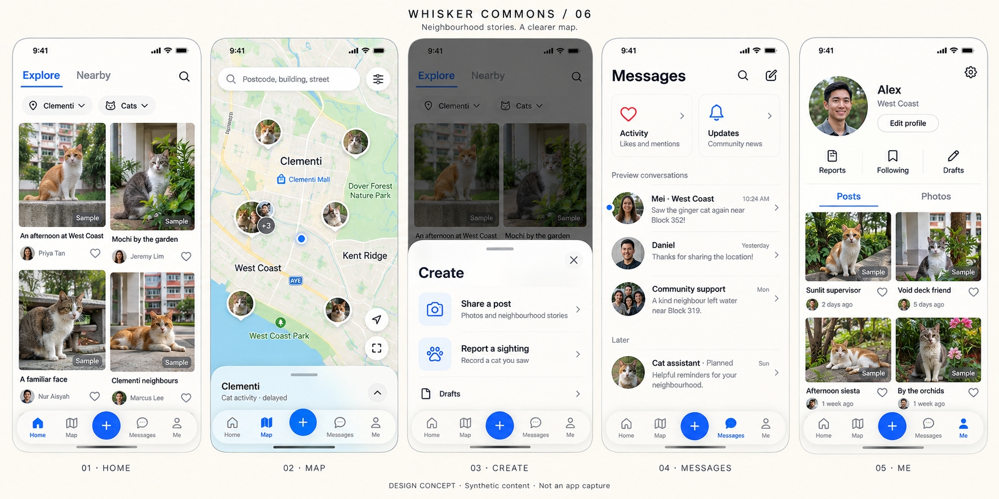
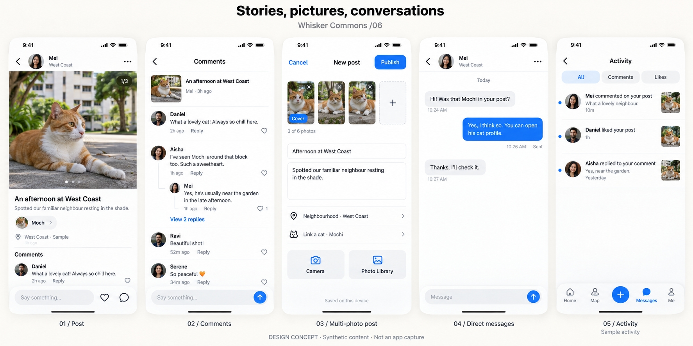

<p align="center">
  
</p>

<h1 align="center">WhiskerCommons</h1>

<p align="center">
  <strong>One cat. Shared stories. Lasting care.</strong><br />
  让同一只猫，被不同的人持续认识、记住和关心。<br />
  A free, privacy-first community-cat platform taking shape in Singapore.
</p>

<p align="center">
  <a href="#what-you-can-do">Features</a> ·
  <a href="#quick-start">Quick start</a> ·
  <a href="#project-status">Project status</a> ·
  <a href="#roadmap">Roadmap</a> ·
  <a href="#documentation">Documentation</a>
</p>

<p align="center">
  <a href="https://github.com/ZP151/anicare/actions/workflows/ci.yml"></a>
  <a href="LICENSE"></a>
</p>

WhiskerCommons helps neighbours recognise a recurring community cat, share their
encounters, and preserve useful identity and care records. Its current focus is
a cat's shared story across different contributors, with human review for
identity decisions and privacy built into reporting.

**Development snapshot — 2026-09-15:** iOS **0.4.18 (26)** has recorded build,
provenance and delivery evidence; its device acceptance is pending. The app is
under active development toward a closed Singapore pilot. Current validation
uses synthetic data and does not establish public-pilot readiness.



*Product design · v6. Synthetic content, not an app capture. The concepts show
the visual direction; implemented features and pending work are described below.*

## Why WhiskerCommons?

A photo captures one encounter. A lasting community record should help the next
person recognise the same cat, understand what others have observed or done,
and correct a mistake without losing the history.

- **Give each cat a continuing story.** Bring different people's encounters
  together on a cat profile, with links back to the original posts and authors.
- **Make care understandable.** Keep completed care and sighting records
  distinct from casual stories, so a photo or comment does not imply treatment
  or a recent sighting.
- **Let people contribute before they know the identity.** Share an unknown or
  multi-cat encounter, then add or correct its cat association later.
- **Protect the animals and their neighbours.** Use approximate, delayed
  sighting locations, independent identity review, and auditable correction.

The [current product goals](docs/product-goals.md) and
[v4 roadmap](docs/iteration-roadmap-v4.md) define this direction. The
[original charter](docs/product-charter.md) preserves the formal pilot goals;
its early feature exclusions are historical where later approved iterations
have added community posts and private messages.

## What you can do

These workflows are implemented in the current source. Device acceptance and
remaining product work are tracked separately below.

| Workflow | Current experience |
| --- | --- |
| Discover neighbourhood cats | Browse photo-led community posts and a Singapore map, explore neighbourhoods, and open cat profiles. |
| Read and share a cat's stories | Read visible posts from different authors on one cat profile; publish with an optional cat link, return to the profile, or correct your own post's association. |
| Report a sighting | Follow a four-step report, review and mask its photo, save an encrypted draft, and continue identity selection or review from the receipt. |
| Record completed care | Add care events, read permitted history, and correct or withdraw your own records. |
| Participate in the community | Publish text or 1–6 photos, edit and reorder images, comment and reply, react, and open activity notifications. Private messaging includes request/accept/decline flows. |
| Find your contributions again | Follow cats, reopen drafts and reports, manage posts and photos, and edit your public name, avatar and neighbourhood. A dedicated followed-cat story update feed is still planned. |
| Review and resolve problems | Report or block content, submit rights requests, and use the role-gated Admin identity and rights queues. |

The mobile interface supports English and Simplified Chinese, light and dark
appearance, and native iOS glass with accessible fallbacks. Platform appearance,
large text and assistive-technology behaviour require device verification.



*Product design · v6. These sample stories, people and conversations illustrate
the intended experience, not real community activity or device acceptance.*

### Two connected journeys

```text
Discover a cat → Read shared stories → Share an encounter → Revisit its profile
                                           |
                              Add or correct a story's cat link

Report a sighting → Propose an identity → Independent review → Cat record
                                                                |
                                                 Completed care + corrections
```

**A story's cat link is the author's association, not an identity decision.**
Stories do not automatically create sightings or completed care. AI remains
optional assistance under development and never confirms identity on its own.

The later [C0 cat-profile and publishing design](docs/design/cat-centered-c0/README.md)
extends the v6 foundation around shared cat stories.

## Quick start

### Requirements

- **Node.js 22** to match CI; **pnpm 11.19.0** as pinned in `package.json`.
- **Python 3.12–3.13** for the AI service and full workspace verification.
- **Docker**, **Supabase CLI 2.84.2**, and **Deno 2.9.5** for local database/Edge
  integration checks, matching the CI configuration.
- A custom native build for SQLCipher, native maps and device media flows.
  Expo Go and a web preview do not exercise the complete app.

### Install and run from source

```bash
git clone https://github.com/ZP151/anicare.git
cd anicare
pnpm install --frozen-lockfile
pnpm --filter @animalhelper/domain build
```

Use [`.env.example`](.env.example) as the variable reference. Put **only** the
mobile `EXPO_PUBLIC_*` values in `apps/mobile/.env.local`; put the Admin
`NEXT_PUBLIC_*` and required server settings in `apps/admin/.env.local`.
These files are ignored by Git. Use your own development Supabase project and
its public client key; the repository's recorded hosted project is not a shared
development service. See [backend configuration](docs/runbooks/development-operations.md)
for migrations, Auth, media and server-only settings.

Run each client in a separate terminal:

```bash
pnpm --filter @animalhelper/mobile dev
pnpm --filter @animalhelper/admin dev
```

The mobile command starts the Expo development server; Admin starts Next.js.
Without a configured backend, some screens can show demo/fallback content,
while authenticated and persisted workflows need a configured environment.
Web export is a build check and preview surface, not the native release target.

iOS uses Apple Maps. Android map builds require the build-time
`GOOGLE_MAPS_ANDROID_API_KEY`; see [app configuration](apps/mobile/app.config.ts).
The experimental Windows-to-iPhone candidate verification and signing path is
documented in the [device runbook](docs/runbooks/ios-free-account-device-test.md).
There is no public App Store installation path documented for this pilot yet.

### Optional AI development service

```bash
python -m pip install -e "services/ai[dev]"
pnpm --filter @animalhelper/ai dev
```

This starts the FastAPI service. The internal identity endpoint is disabled by
default; its explicit flag and token enable a model-free compatibility
contract, not production cat recognition. See [AI contracts](docs/ai-contracts.md)
and the separate [offline evaluation guide](services/ai/OFFLINE_EVALUATION.md).
Install the Python dependencies above before full workspace verification even
when you do not run the service.

## Development checks

```bash
# Fast regression for the core report, identity, care and account journeys
pnpm test:product-core

# Full workspace policy, workflow, lint, type, test and build checks
pnpm verify

# Independent local Supabase HTTP/Auth/Storage and database integration
pnpm pilot-gate-2a
```

The required [CI workflow](.github/workflows/ci.yml) runs `verify` and
`database-contracts` as separate jobs, plus peer dependency and Python Ruff/mypy
checks. The fast product suite does not replace them. Consult the
[regression playbook](docs/regression-playbook.md) for targeted checks and
when hosted or physical-device evidence is needed.

## Privacy and trust boundaries

| Boundary | Behaviour |
| --- | --- |
| Sighting locations | Public projections use H3 resolution 9 cells, not precise coordinates. Normal sightings are delayed two hours, sensitive ones 24 hours, and critical ones remain hidden for review. |
| Report photos | Source-image bytes are not uploaded. A reviewed, newly rendered JPEG enters private staging/quarantine; report-media public promotion remains disabled. |
| Community photos and avatars | Separate media flows serve currently permitted public content. Publishing a story does not expose private report material or grant identity verification. |
| Local drafts | Encrypted, account-bound recovery; sighting drafts do not persist coordinates or access tokens. Location is requested again at explicit submission. |
| Identity and AI | Contributor selections are tentative until independent review. Public results use confidence bands and reasons rather than internal numeric scores. Live AI assistance remains disabled by default. |
| Privileged operations | Precise-location grants are task-specific, audited and expire within 24 hours. Service-role credentials stay in trusted server runtimes. |
| Rights and deletion | The Admin queue records durable completion, pending cleanup or retryable failure. An intake receipt or a cleanup invocation is not proof of completed deletion. |

Automatic person, licence-plate and cat detectors remain disabled pending their
device, model, licence and adversarial-corpus gates. Supply an operated rights
contact and complete the [Singapore launch checklist](docs/singapore-launch-checklist.md)
before real-user use. Operational details are in the
[development and operations guide](docs/runbooks/development-operations.md).

## Project status

The latest recorded candidate is **0.4.18 (26)**, built from **`74e3b49`**.
Its [delivery record](docs/reviews/2026-09-14-global-simplification.md) links the
CI and native build results and records artifact integrity and provenance.
**Device acceptance remains pending.** The previously accepted core baseline
is 0.4.13, with the subsequent refresh fix also confirmed; C1 device failures
and their repairs remain visible in the [device test ledger](docs/ios-next-device-test.md).

| Area | Evidence and remaining work |
| --- | --- |
| Core reports, care and community | Implemented through the M-series and v6 iterations, with automated and recorded incremental device checks. Evidence applies to its named version and scenario. |
| C1 shared cat stories | Profile aggregation, linked publishing and owner correction are implemented. 0.4.17 repaired loading, sample breadth and headers; two-account contribution and remaining device checks are pending. |
| Hosted media and delivery | Gate 2A local-stack and Gate 2B hosted evidence exist. The earlier evidence-consumer blocker has been resolved; the committed Gate 2B receipt is source-bound and expires after 72 hours, so it is not evergreen release approval. |
| Media maintenance | The signed database scheduler and hosted expiry checks were delivered in 0.4.13. The protected GitHub cleanup job remains a manual maintenance path. |
| AI and public pilot | Offline tooling and synthetic contracts exist; licensed held-out identity data and real accuracy results are still missing. Operational, privacy and formal pilot gates remain open. |

The [Gate 2B runbook](docs/runbooks/hosted-gate-2b.md),
[committed readiness receipt](docs/evidence/pilot-gate-2b-readiness.json), and
[media-maintenance evidence](docs/reviews/2026-09-13-v6-r0413-core-continuation.md)
contain the exact scope. Recorded delivery does not imply that every device,
environment or later commit has passed the same checks.

## Roadmap

| Stage | Outcome and status |
| --- | --- |
| Foundation and safe capture | Privacy/domain contracts, private media staging, encrypted drafts, identity review and local/hosted verification foundations. |
| M0–M5 and A0 | Manual report → identity → care loop, discovery/following, rights operations, faster regression, iOS candidates and bounded offline AI evaluation. |
| 0.2–0.3 neighbourhood iterations | Singapore neighbourhood navigation, bilingual presentation, community participation and device-feedback fixes. |
| v6 / 0.4.0–0.4.13 | Multi-photo publishing, real interactions and private messages, photo editing, draft recovery, personal albums and scheduled cleanup. |
| C0–C1 / 0.4.14–0.4.18 | Cat-centred design, shared stories, optional cat linking and correction, then device-feedback repairs and simpler actions. C0 is complete; C1 device acceptance remains open. |
| Next: C2 | Discover/followed views, new stories grouped by followed cat, and reliable read progress. Planned after C1 stabilises. |
| Then: C3 | A cat's shared photo album, contribution management and a complete journey ready for small user studies. Planned. |

The [v4 roadmap](docs/iteration-roadmap-v4.md) supersedes unfinished priorities
in older plans. Video, administrator/Bot experiences and further chat expansion
are deferred. Reliability, deletion, account isolation and old-draft
compatibility remain ongoing responsibilities.

The care-value target is the number of cats with independently confirmed
identity, valid contributions from at least two people, and at least one
completed care event within 14 days. Shared-story participation and useful
return visits are additional proposed measures. **These product outcomes are
not yet measured**; synthetic sample counts are not adoption or welfare results.
See [metric definitions](docs/product-goals.md).

## Architecture

```text
Expo / React Native mobile           Next.js Admin
  stories, maps, reports               identity review, rights, moderation
  encrypted local drafts                         |
             |                                    |
             +------- Supabase Auth + RPC / Edge --+
                                |
                  PostgreSQL / RLS / audit records
                                |
            Private report media | Community media / avatars

Python AI service: isolated contracts and offline evaluation;
live identity assistance remains gated.
```

| Area | Location |
| --- | --- |
| Mobile app, native configuration and device policies | [`apps/mobile`](apps/mobile) |
| Private operations console | [`apps/admin`](apps/admin) |
| Shared domain and privacy behaviour | [`packages/domain`](packages/domain) |
| Migrations, pgTAP tests and Edge Functions | [`supabase`](supabase) |
| Python AI contracts and evaluation | [`services/ai`](services/ai) |
| CI, deployment evidence and verification tooling | [`scripts`](scripts) |

WhiskerCommons is the display brand. The repository name `anicare`, package
scope `@animalhelper`, Python imports, `animalhelper://` OAuth scheme and native
identifiers remain compatible technical names. See the
[architecture notes](docs/architecture.md) for the foundational data model and
the v4 plans for later story and community extensions.

## Documentation

| Start here | Purpose |
| --- | --- |
| [Product goals](docs/product-goals.md) · [v4 roadmap](docs/iteration-roadmap-v4.md) | Current priorities, outcomes and next increments. |
| [Device test ledger](docs/ios-next-device-test.md) · [delivery reviews](docs/reviews) | Versioned delivery evidence, feedback and pending checks. Local IPA paths in historical records are maintainer handoff paths. |
| [Development and operations](docs/runbooks/development-operations.md) | Auth, service configuration, cleanup and rights processing. |
| [Regression playbook](docs/regression-playbook.md) · [Hosted Gate 2B](docs/runbooks/hosted-gate-2b.md) | Verification layers and evidence promotion. |
| [Synthetic sample catalogue](docs/test-samples/ios-v1/README.md) | Test content, provenance and fixture boundaries. |
| [Product charter](docs/product-charter.md) · [launch checklist](docs/singapore-launch-checklist.md) | Original pilot goals and formal launch requirements. |
| [AI contracts](docs/ai-contracts.md) · [offline evaluation](services/ai/OFFLINE_EVALUATION.md) | Disabled-by-default assistance and evaluation requirements. |

## Contributing

Start with the current roadmap and a reproducible user journey. For a bug,
[open an issue](https://github.com/ZP151/anicare/issues) with the app version,
platform, steps, expected/actual behaviour and sanitised evidence. Use synthetic
data in reproductions; keep credentials, precise locations and private photos
out of issues and commits. Include the relevant regression checks in your PR.

## Related projects and documentation references

These references informed the README's organisation, not claims of feature
parity or code reuse:

- [MergePilot](https://github.com/ZP151/mergepilot) and
  [Archeform](https://github.com/ZP151/archeform): product-first introductions,
  workflow explanations, quick starts, architecture and evidence-backed status.
- [iNaturalist](https://github.com/inaturalist/inaturalist) and its
  [React Native client](https://github.com/inaturalist/iNaturalistReactNative):
  community observation context, contributor guidance and explicit mobile setup.
- [Immich](https://github.com/immich-app/immich): a visual project introduction,
  scannable feature tables and direct documentation links.
- [Animal Shelter Manager](https://github.com/sheltermanager/asm3): an adjacent
  animal-care project with explicit runtime and operational dependencies.

## License

WhiskerCommons is licensed under [Apache 2.0](LICENSE).
